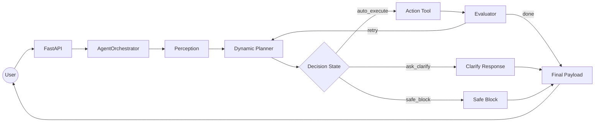
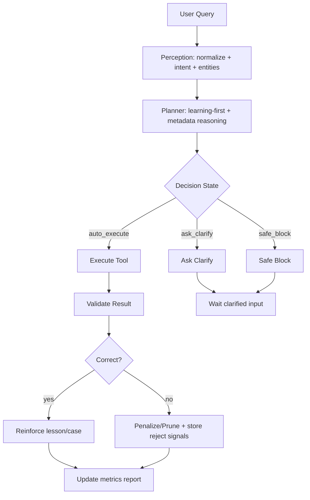

# AGENTIC CORE v3.6 | Dynamic Planner + Self-Learning

`Agentic Core` là hệ thống AI vận hành nghiệp vụ theo mô hình `Perceive -> Reason -> Act -> Eval`, đã được nâng cấp với:

- Dynamic metadata planner ưu tiên học từ kinh nghiệm trước.
- Uncertainty manager (`auto_execute`, `ask_clarify`, `safe_block`).
- Fast-path + cache để giảm độ trễ planner.
- Matrix learning/eval tự động để theo dõi chất lượng và tiến hóa theo dữ liệu thật.

---

## System Flow (Current)



## Learning & Correctness Flow



### Correctness checklist (pass/fail)

- `PASS` khi: tool đúng, entity/filter khớp, path/choice đúng, không vi phạm policy/strict.
- `FAIL` khi: tool drift, mismatch entity/filter, reuse lesson sai ngữ cảnh, hoặc execute khi đáng ra phải clarify/block.
- Hệ thống đo liên tục qua:
  - `tool_accuracy`
  - `entity_match_rate`
  - `path_resolution_success`
  - `choice_constraint_success`
  - `strict_block_rate`
  - `decision_state_rate`

### Runtime behavior

1. `Perception`: chuẩn hóa query, trích xuất intent/entity, request contract.
2. `Reason`:
   - Ưu tiên `knowledge_hits` nếu tương thích entity/structure.
   - Nếu không, chạy metadata planner với:
     - intent fast-path,
     - autonomous scoring theo table alias + case memory,
     - join path + choice constraints.
3. `Uncertainty`:
   - `auto_execute`: đi tiếp sang `Action`.
   - `ask_clarify`: dừng DB call, trả câu hỏi làm rõ ngay cho user.
   - `safe_block`: chặn trong strict mode khi thiếu bằng chứng đã học.
4. `Action + Eval`: thực thi tool, đánh giá dữ liệu trả về, cập nhật learning.
5. `Final`: trả `final_payload` gồm `final_result`, `planner_trace`, `selected_tool`, `db_call_executed`.

---

## Planner Enhancements (v3.6)

- **Fast path**: bypass scoring khi intent rõ/tín hiệu đủ.
- **Planner cache**: cache cục bộ cho `match_case`, `extract_entities`, `find_paths`.
- **Adaptive uncertainty calibration**:
  - `calibrated_evidence_floor` được điều chỉnh theo `knowledge score` và `case_success_ratio`.
- **Governance guardrails**:
  - `complexity_score`
  - `PLANNER_COMPLEXITY_BUDGET`
  - cờ `complexity_budget_exceeded`.

---

## Evaluation Metrics (Matrix Report)

File báo cáo: `storage/dynamic_eval_report.json`

Các metric chính:

- `tool_accuracy`
- `path_resolution_success`
- `choice_constraint_success`
- `entity_match_rate`
- `strict_block_rate`
- `decision_state_rate` (`auto_execute` / `ask_clarify` / `safe_block`)
- `decision_reason_distribution`
- `avg_calibrated_evidence_floor`
- `latency_ms` (`mean`, `p50`, `p95`)

Chạy eval:

```bash
python scripts/eval_dynamic_cases.py
```

---

## Key Configuration

Trong `infra/settings.py`:

- `ENABLE_DYNAMIC_METADATA_PLANNER`
- `STRICT_LEARNED_ONLY_MODE`
- `STRICT_MIN_EVIDENCE_SIMILARITY`
- `UNCERTAINTY_BASE_ASK_CLARIFY_EVIDENCE`
- `UNCERTAINTY_LEARNING_SCORE_BONUS_MAX`
- `UNCERTAINTY_CASE_SUCCESS_BONUS_MAX`
- `PLANNER_COMPLEXITY_BUDGET`
- `MATRIX_CASE_MIN_SIMILARITY`
- `MATRIX_CASE_PRIOR_WEIGHT`

---

## Quick Start

```bash
pip install -r requirements.txt
python seed_db.py
python main.py
```

Truy cập: `http://127.0.0.1:8000`
