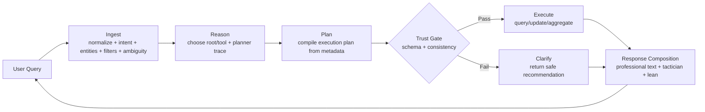
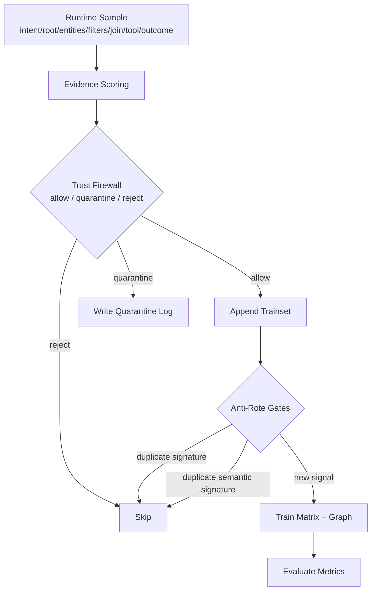

# AGENTIC CORE v3.6 | Dynamic Planner + Self-Learning

`Agentic Core` là hệ thống AI vận hành nghiệp vụ theo mô hình `Perceive -> Reason -> Act -> Eval`, đã được nâng cấp với:

- Dynamic metadata planner ưu tiên học từ kinh nghiệm trước.
- Uncertainty manager (`auto_execute`, `ask_clarify`) + trust gate consistency.
- Fast-path + cache để giảm độ trễ planner.
- Matrix learning/eval tự động để theo dõi chất lượng và tiến hóa theo dữ liệu thật.

---

## Runtime Flow (v2)

Luồng runtime được tách thành 2 nhánh rõ ràng: `execute` hoặc `clarify`.



## Flow Sitemap (Expand/Collapse)

<details>
<summary><b>[+] 1) Runtime Request Path</b></summary>

- Entry: `main.py` -> `/api/v2/run`
- Orchestrator: `v2/service.py` -> `run_v2_pipeline(...)`
- Ingest: `v2/ingest/parser.py`
- Reason: `v2/reason/core.py`
- Plan: `v2/plan/compiler.py`
- Trust Gate: `v2/execute/validator.py` + consistency checks in `v2/service.py`
- Execute: `v2/execute/runtime.py`
- Respond: `v2/service.py` (`_build_professional_response`, tactician, lean)

</details>

<details>
<summary><b>[+] 2) Learning Path (After Runtime)</b></summary>

- Build sample: `v2/service.py` (`_build_runtime_learning_sample`)
- Firewall: `v2/learn/firewall.py` (`allow/quarantine/reject`)
- Anti-rote gate: `v2/learn/trainset.py` (`signature`, `semantic_signature`)
- Train/Eval:
  - `v2/learn/matrix.py`
  - `v2/learn/graph.py`
- Artifacts:
  - `storage/v2/matrix/*`
  - `storage/v2/graph/*`
  - `storage/v2/firewall/*`

</details>

<details>
<summary><b>[+] 3) Context Memory Path</b></summary>

- Context store: `v2/memory.py`
- APIs:
  - `GET /api/v2/contexts`
  - `POST /api/v2/contexts`
  - `DELETE /api/v2/contexts/{session_id}`
  - `DELETE /api/v2/contexts` (clear all)
- UI controls: `web/templates/v2_console.html` (create/switch/delete/clear-all context)

</details>

<details>
<summary><b>[+] 4) Async Event Lifecycle Path</b></summary>

- Publish endpoint: `POST /api/v2/events/publish`
- Worker path:
  - `v2/ingest/pubsub_ingress.py`
  - `v2/ingest/pubsub_worker.py`
  - `v2/lifecycle/status_runtime.py`
- Status endpoint: `GET /api/v2/events/{event_id}`
- State icons: `queued -> analyzing -> processing -> done/clarify/error`

</details>

### Runtime Gate Contract

- `ask_clarify` chỉ dùng khi: ambiguity cao, thiếu entity chính, hoặc vi phạm schema/trust gate.
- `auto_execute` chỉ đi tiếp khi: plan hợp lệ + consistency pass.
- `empty result` là outcome hợp lệ của execution, không phải trust failure.

## Learning Flow (Trust + Anti-Rote)

Luồng học chạy sau runtime response và có firewall chặn trước khi ghi tri thức.



### Learning Decision Rules

- `allow + new semantic signal` -> append + retrain.
- `allow + duplicate meaning` -> skip (không học vẹt).
- `quarantine/reject` -> không đưa vào tri thức active.

### Lean Flow Spec (ý nghĩa chuẩn)

`Lean flow` trong hệ thống này nghĩa là: **ít bước nhất nhưng vẫn đúng và an toàn**.

Lean hiện tại gồm **2 lớp riêng biệt**:

1. **Lean Decision (luồng quyết định):**
   - Không đủ tín hiệu -> `ask_clarify` (không query DB bừa).
   - Đủ tín hiệu + trust gate pass -> chạy đúng 1 tool chính.
   - Có kết quả hợp lệ -> kết thúc sớm, không loop dư.
   - Sai/mismatch -> ghi tín hiệu học lại, không chồng heuristic nóng.

2. **Lean Personalization (luồng trình bày):**
   - Không đổi logic DB/planner, chỉ đổi khung câu trả lời theo vai trò.
   - `JUNIOR`: thêm hướng dẫn thao tác ngắn, từng bước.
   - `SENIOR`: thêm framing chiến lược, ngắn gọn.
   - `DEFAULT`: giữ trung tính.
   - Code ở: `v2/service.py` -> `_apply_lean_personalization(...)`.
   - Tactician payload ở: `v2/tactician/core.py` -> `build_tactician_payload(...)`.

3. **Reasoning Integrity (tách lớp suy luận và trình bày):**
   - `decision_state` + `execution_plan` được fingerprint riêng (`plan_fingerprint`).
   - Lean/tactician chỉ được phép đổi lớp output text, không đổi core decision.
   - Theo dõi tại `reasoning_integrity` trong payload runtime.

Mục tiêu của lean flow:

- Giảm latency (`p50/p95`).
- Giảm số lần retry loop không tạo giá trị.
- Tăng tỉ lệ đúng ngay lần đầu (`first-pass`).
- Giữ an toàn (không suy diễn khi bằng chứng yếu).

### Correctness checklist (pass/fail)

- `PASS` khi: tool đúng, entity/filter khớp, path/choice đúng, không vi phạm policy/strict.
- `FAIL` khi: tool drift, mismatch entity/filter, reuse lesson sai ngữ cảnh, hoặc execute khi đáng ra phải clarify/block.
- Hệ thống đo liên tục qua:
  - `tool_accuracy`
  - `entity_match_rate`
  - `path_resolution_success`
  - `choice_constraint_success`
  - `strict_block_rate`
  - `decision_state_rate`

## Learning Points In Code (học ở đâu)

Các điểm hệ thống thực sự "học" theo runtime:

1. **Recall tri thức trước khi execute**
   - `v2/service.py` điều phối chuỗi `ingest -> reason -> plan -> execute`.
   - Planner trace nằm trong `planner_trace_v2`.

2. **Học từ kết quả thành công/thất bại**
   - `v2/service.py` gọi `record_outcome(...)`.
   - Runtime sample được append qua `append_trainset_sample(...)`.

3. **Gate kiểm soát độ tin cậy**
   - `validate_execution_plan(...)` chặn sai schema.
   - `_validate_reasoning_consistency(...)` chặn mismatch giữa ingest/reason/plan.

4. **Huấn luyện/eval matrix**
   - `train_matrix_v2()` + `evaluate_matrix_v2()`.
   - Artifacts ở `storage/v2/matrix/*`.

5. **Đánh giá chất lượng học**
   - Snapshot/check nằm trong `learning_check` và `learning_update`.
   - Báo cáo matrix nằm ở `storage/v2/matrix/matrix_v2_eval.json`.
   - Báo cáo firewall nằm ở `storage/v2/firewall/trust_firewall_eval_v2.json`.

6. **Chống học vẹt (Anti-rote)**
   - Dedupe theo `signature` + outcome.
   - Dedupe theo semantic template (`intent + root + query_template`) để bỏ các mẫu chỉ khác câu chữ.
   - **Phase mới: `phase_understanding_v2`** dedupe theo `semantic_signature` (intent/root/entities/filter_fields/join_targets/tool/semantic template) để ưu tiên học theo ý nghĩa thực thi thay vì học theo mặt chữ.
   - Redact dữ liệu literal (query/filter value) trước khi ghi trainset/log.

## Component Flow Map (Where To Read Code)

| Stage | Responsibility | Main File |
|---|---|---|
| Ingest | Parse query + extract intent/entities/filters/update payload | `v2/ingest/parser.py` |
| Reason | Select root/tool + build planner trace | `v2/reason/core.py` |
| Plan | Normalize filter/root/join via metadata provider | `v2/plan/compiler.py` |
| Validate | Schema + join + filter guardrails | `v2/execute/validator.py` |
| Execute | Query / Update / Aggregate runtime | `v2/execute/runtime.py` |
| Respond | Professional response + tactician + lean layer | `v2/service.py` |
| Learn | Firewall, anti-rote gate, train/eval artifacts | `v2/learn/*`, `v2/service.py` |

## Request Lifecycle (Step-by-Step)

1. **Perceive**
   - Normalize user text and role.
   - Produce `intent`, `entities`, `request_filters`, `update_data`, `ambiguity_score`.
2. **Reason**
   - Build `planner_trace_v2`.
   - Choose `root_table`, `tool`, and initial join direction.
3. **Act**
   - Compile execution plan from metadata.
   - Validate via guardrails + trust consistency.
   - Execute only when trusted.
4. **Eval**
   - Build runtime learning sample.
   - Apply firewall policy + anti-rote dedupe.
   - Retrain/evaluate only when new meaningful signal exists.

### Event lifecycle (Pub/Sub-style)

- Ingress endpoint: `POST /api/v2/events/publish` trả ack nhanh và tạo lifecycle status.
- Event status endpoint: `GET /api/v2/events/{event_id}`.
- Lifecycle state map:
  - `queued` -> `⏳`
  - `analyzing` -> `📊`
  - `processing` -> `🛠️`
  - `done` -> `✅`
  - `clarify` -> `❓`
  - `error` -> `❌`
- SLA điều chỉnh qua `EVENT_ACK_SLA_MS` (mặc định 1500ms).

---

## Planner Enhancements (v3.6)

- **Fast path**: bypass scoring khi intent rõ/tín hiệu đủ.
- **Planner cache**: cache cục bộ cho `match_case`, `extract_entities`, `find_paths`.
- **Adaptive uncertainty calibration**:
  - `calibrated_evidence_floor` được điều chỉnh theo `knowledge score` và `case_success_ratio`.
- **Governance guardrails**:
  - `complexity_score`
  - `PLANNER_COMPLEXITY_BUDGET`
  - cờ `complexity_budget_exceeded`.

---

## Evaluation Metrics (Matrix Report)

File báo cáo: `storage/v2/matrix/matrix_v2_eval.json`

Các metric chính:

- `tool_accuracy`
- `path_resolution_success`
- `choice_constraint_success`
- `entity_match_rate`
- `strict_block_rate`
- `decision_state_rate` (`auto_execute` / `ask_clarify`)
- `decision_reason_distribution`
- `avg_calibrated_evidence_floor`
- `latency_ms` (`mean`, `p50`, `p95`)

Chạy eval:

```bash
python scripts/eval_dynamic_cases.py
```

---

## Key Configuration

Trong `infra/settings.py`:

- `ENABLE_DYNAMIC_METADATA_PLANNER`
- `STRICT_LEARNED_ONLY_MODE`
- `STRICT_MIN_EVIDENCE_SIMILARITY`
- `UNCERTAINTY_BASE_ASK_CLARIFY_EVIDENCE`
- `UNCERTAINTY_LEARNING_SCORE_BONUS_MAX`
- `UNCERTAINTY_CASE_SUCCESS_BONUS_MAX`
- `PLANNER_COMPLEXITY_BUDGET`
- `MATRIX_CASE_MIN_SIMILARITY`
- `MATRIX_CASE_PRIOR_WEIGHT`
- `EVENT_ACK_SLA_MS`

---

## Quick Start

```bash
pip install -r requirements.txt
python seed_db.py
python main.py
```

Truy cập: `http://127.0.0.1:8000`

## Regression check

```bash
python scripts/regression_v2_runtime.py
```

Bao gồm kiểm tra:
- detail/follow-up flow
- event lifecycle ack
- tactician + firewall
- reasoning vs lean integrity
