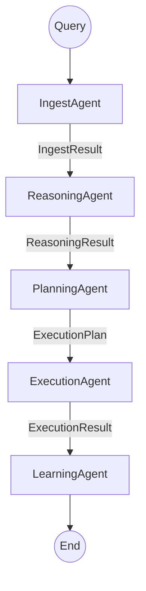

# DANN AGENTIC CORE (v4.0)

Hệ thống AI nghiệp vụ **DANN (Dynamic Agentic Neural Network)** thế hệ mới, vận hành theo mô hình **Multi-Agent Orchestration** và **State-Driven Workflow**.

---

## 1. Kiến trúc Hệ thống (Agentic Flow)
Hệ thống vận hành theo chu trình **State-Passing**, nơi mỗi Agent nhận vào một trạng thái hệ thống (`AgentState`) và trả về một dictionary kết quả để update state. 


```mermaid
graph TD
    Start((Query)) --> Ingest[IngestAgent]
    Ingest -- IngestResult --> Reason[ReasoningAgent]
    Reason -- ReasoningResult --> Plan[PlanningAgent]
    Plan -- ExecutionPlan --> Execute[ExecutionAgent]
    Execute -- ExecutionResult --> Learn[LearningAgent]
    Learn --> End((End))
```

## 2. Technical Stack & Architectural Rationale
Hệ thống không sử dụng các framework đóng gói sẵn (như CrewAI) mà lựa chọn **thành phần tối ưu** để đảm bảo khả năng tùy biến cao:

| Công nghệ/Pattern | Lớp sử dụng | Mục đích & Lý do lựa chọn |
|---|---|---|
| **LangGraph** | Orchestrator (`v2/graph/`) | Điều phối đồ thị trạng thái (State Graph). **Tại sao:** Cho phép định nghĩa luồng logic phức tạp, có vòng lặp (cyclic) và quản lý state trung tâm tốt hơn các linear pipeline. |
| **BabyAGI Pattern** | Planning (`v2/agents/planning/`) | Phân tách goal thành Task list. **Tại sao:** Tối ưu hóa việc chia nhỏ yêu cầu nghiệp vụ phức tạp thành các tác vụ thực thi đơn lẻ, có thể truy xuất (traceability). |
| **MCP (Model Context Protocol)** | Interface (`v2/api_clients.py`) | Kết nối ngữ cảnh. **Tại sao:** Tiêu chuẩn hóa việc LLM truy cập context/tools, giúp hệ thống không bị phụ thuộc vào một provider cụ thể. |

*Ghi chú: Chúng tôi không sử dụng CrewAI hay AutoGPT do tính "black-box" cao, khó kiểm soát state và khó tích hợp sâu vào hệ thống nghiệp vụ CRM hiện có.*

## 3. Các lớp thành phần (Component Classes)
Hệ thống sử dụng các Dataclass chính (trong `core/contracts.py`):
- **`IngestResult`**: Kết quả chuẩn hóa từ IngestAgent.
- **`RequestFilter`**: Điều kiện truy vấn.
- **`ExecutionPlan`**: Chỉ dẫn thực thi từ PlanningAgent.
- **`ExecutionResult`**: Kết quả từ DB/Storage.

## 4. Phân cấp Agent
| Agent | Module Path | Vai trò |
|---|---|---|
| **IngestAgent** | `v2/agents/ingest/` | Parse query sang `IngestResult`. |
| **ReasoningAgent**| `v2/agents/reasoning/` | Phân tích logic và Persona. |
| **PlanningAgent** | `v2/agents/planning/` | Compile `IngestResult` thành `ExecutionPlan`. |
| **ExecutionAgent**| `v2/agents/execution/` | Thực thi plan và tương tác storage. |
| **LearningAgent** | `v2/agents/learning/` | Cập nhật tri thức từ kết quả thực thi. |

## 5. Cơ chế truyền tải (Data Flow)
1. **Serialization**: Đối tượng (như `IngestResult`) serialize thành dictionary qua `__dict__` khi chuyển trạng thái.
2. **Reconstruction**: `PlanningAgent` và các Agent tiêu thụ thực hiện tái tạo đối tượng từ dictionary trước khi xử lý để tránh lỗi truy xuất thuộc tính.

## 6. Hướng dẫn chạy
```bash
# Cài đặt môi trường
pip install -r requirements.txt

# Khởi chạy Cockpit
python main.py
```
Truy cập: `http://127.0.0.1:8000`
