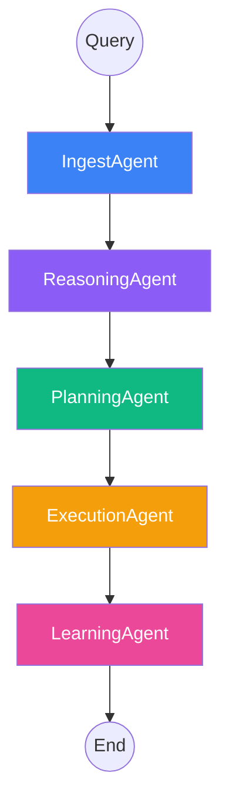

# DANN AGENTIC CORE (v4.0)

Hệ thống AI nghiệp vụ **DANN (Dynamic Agentic Neural Network)** thế hệ mới, vận hành theo mô hình **Multi-Agent Orchestration** dựa trên **LangGraph** và **MCP (Model Context Protocol)**.

---

## 1. Kiến trúc Hệ thống (Agentic Flow)
Hệ thống chuyển dịch từ mô hình Pipeline tuần tự cũ sang cấu trúc **Đồ thị Tự hành (State Machine)**, cho phép các Agent tự đưa ra quyết định, lập kế hoạch và học hỏi từ kết quả thực thi.


```mermaid
graph TD
    Start((Query)) --> Ingest[IngestAgent]
    Ingest --> Reason[ReasoningAgent]
    Reason --> Plan[PlanningAgent]
    Plan --> Execute[ExecutionAgent]
    Execute --> Learn[LearningAgent]
    Learn --> End((End))
    
    style Ingest fill:#3b82f6,color:#fff
    style Reason fill:#8b5cf6,color:#fff
    style Plan fill:#10b981,color:#fff
    style Execute fill:#f59e0b,color:#fff
    style Learn fill:#ec4899,color:#fff
```

## 2. Phân cấp Agent (Modular Architecture)
Hệ thống được chia nhỏ thành các module độc lập, dễ quản lý, test và scale:

| Agent | Module Path | Trách nhiệm chính |
|---|---|---|
| **IngestAgent** | `v2/agents/ingest/` | Tiếp nhận, chuẩn hóa input, resolve intent. |
| **ReasoningAgent**| `v2/agents/reasoning/` | Phân tích Persona, dự đoán hành động, neural reasoning. |
| **PlanningAgent** | `v2/agents/planning/` | Phân tách goal thành Task list, normalize metadata. |
| **ExecutionAgent**| `v2/agents/execution/` | Thực thi MCP tools, validate và thực hiện query DB. |
| **LearningAgent** | `v2/agents/learning/` | Feedback loop, update Neural Matrix, firewall logs. |

## 3. Quản trị & Điều phối (Cockpit Console)
Dashboard chuyên nghiệp để vận hành hệ thống:
- **Live Trace Stream:** Log thời gian thực của từng Agent (color-coded).
- **Cockpit Control:** Nút Reset Context & Force Retrain cho DANN.
- **Neural Anatomy:** Theo dõi sự "tiến hóa" của Neural Matrix qua các metric thời gian thực.

## 4. Hướng dẫn phát triển
- **Độc lập:** Mỗi Agent trong `v2/agents/` chỉ có một trách nhiệm duy nhất (SRP).
- **Giao tiếp:** Các Agent không gọi trực tiếp lẫn nhau mà thông qua `AgentState` được quản lý bởi `LangGraph Orchestrator` (`v2/graph/orchestrator.py`).
- **Tri thức:** Mọi quyết định được hỗ trợ bởi `NeuralMatrix` và `KnowledgeGraph` lưu trữ tại `storage/v2/dann/`.

## 5. Chạy hệ thống
```bash
# Cài đặt môi trường
pip install -r requirements.txt

# Khởi chạy Cockpit
python main.py
```
Truy cập: `http://127.0.0.1:8000`
