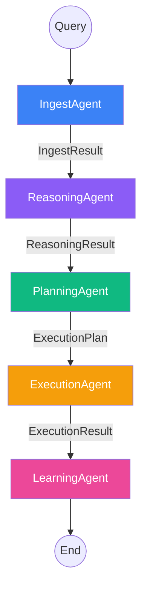

# DANN AGENTIC CORE (v4.0)

Hệ thống AI nghiệp vụ **DANN (Dynamic Agentic Neural Network)** thế hệ mới, vận hành theo mô hình **Multi-Agent Orchestration** và **State-Driven Workflow**.

---

## 1. Kiến trúc Hệ thống (Agentic Flow)
Hệ thống vận hành theo chu trình **State-Passing**, nơi mỗi Agent nhận vào một trạng thái hệ thống (`AgentState`) và trả về một dictionary kết quả để update state. Dữ liệu trung tâm được đóng gói trong `IngestResult` (đối với thông tin input) và được truyền tải xuyên suốt các giai đoạn.


```mermaid
graph TD
    Start((Query)) --> Ingest[IngestAgent]
    Ingest -- IngestResult --> Reason[ReasoningAgent]
    Reason -- ReasoningResult --> Plan[PlanningAgent]
    Plan -- ExecutionPlan --> Execute[ExecutionAgent]
    Execute -- ExecutionResult --> Learn[LearningAgent]
    Learn --> End((End))
    
    style Ingest fill:#3b82f6,color:#fff
    style Reason fill:#8b5cf6,color:#fff
    style Plan fill:#10b981,color:#fff
    style Execute fill:#f59e0b,color:#fff
    style Learn fill:#ec4899,color:#fff
```

## 2. Technical Stack & Framework
Hệ thống được xây dựng trên nền tảng:
- **Orchestration**: **LangGraph** (quản lý các Agent dưới dạng State Machine & Cyclic Graph).
- **Communication Protocol**: **MCP (Model Context Protocol)** dùng để kết nối LLM với ngữ cảnh (context) và công cụ (tools) hệ thống.
- **Neural Storage**: **Neural Matrix** (`v2/intelligence/`) phục vụ cho việc học hỏi và lưu trữ tri thức của mô hình.
- **State Management**: LangGraph State Object chứa mọi thông tin vận hành (`raw_ingest`, `reasoning_trace`, `execution_plan`).

## 3. Các lớp thành phần (Component Classes)
Hệ thống sử dụng các Dataclass chính (trong `core/contracts.py`):
- **`IngestResult`**: Kết quả chuẩn hóa từ IngestAgent.
- **`RequestFilter`**: Điều kiện truy vấn.
- **`ExecutionPlan`**: Chỉ dẫn thực thi từ PlanningAgent.
- **`ExecutionResult`**: Kết quả từ DB/Storage.

## 4. Phân cấp Agent
| Agent | Module Path | Vai trò |
|---|---|---|
| **IngestAgent** | `v2/agents/ingest/` | Parse query sang `IngestResult`. |
| **ReasoningAgent**| `v2/agents/reasoning/` | Phân tích logic và Persona. |
| **PlanningAgent** | `v2/agents/planning/` | Compile `IngestResult` thành `ExecutionPlan`. |
| **ExecutionAgent**| `v2/agents/execution/` | Thực thi plan và tương tác storage. |
| **LearningAgent** | `v2/agents/learning/` | Cập nhật tri thức từ kết quả thực thi. |

## 5. Cơ chế truyền tải (Data Flow)
1. **Serialization**: Đối tượng (như `IngestResult`) serialize thành dictionary qua `__dict__` khi chuyển trạng thái.
2. **Reconstruction**: `PlanningAgent` và các Agent tiêu thụ thực hiện tái tạo đối tượng từ dictionary trước khi xử lý để tránh lỗi truy xuất thuộc tính.

## 6. Hướng dẫn chạy
```bash
# Cài đặt môi trường
pip install -r requirements.txt

# Khởi chạy Cockpit
python main.py
```
Truy cập: `http://127.0.0.1:8000`
