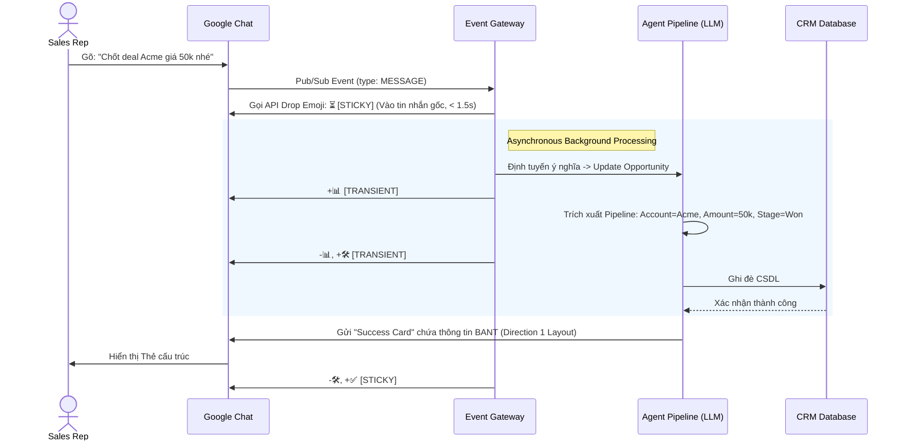
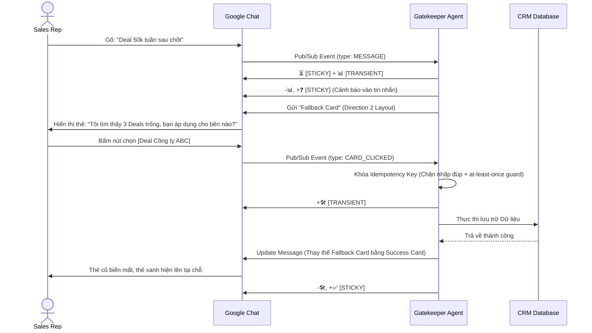

# UX Design Specification LiteNextgenCRM

**Author:** gianglt
**Date:** 2026-04-10

---

## Executive Summary

### Project Vision

LiteNextgenCRM là một hệ thống CRM tương tác trực tiếp qua Google Chat, đóng vai trò như một "System of Action" tự động. Thay vì bắt người dùng chuyển đổi ngữ cảnh và màn hình để nhập liệu, hệ thống cung cấp trải nghiệm "zero-UI" dữ liệu được trích xuất trực tiếp qua luồng chat tự nhiên, kết hợp cùng Trợ lý AI (Multi-Agent) và các tương tác Google Chat Cards V2 trực quan.

### Current Scope Note (Core-first)

Trong giai đoạn hiện tại, ưu tiên thiết kế tập trung vào **core runtime behavior** trước bề mặt chat:
- Chuẩn hóa quyết định `auto_execute` vs `ask_clarify` dựa trên ambiguity + trust gate.
- Tránh chặn sai với các truy vấn có định danh rõ (ví dụ: tên account đầy đủ).
- Nâng chất lượng câu trả lời theo chuẩn "professional, concise, actionable" cho web/API response.
- Áp dụng Persona-Driven Tactician layer (next steps / templates / probe questions) theo vai trò người dùng.
- Áp dụng Learning Trust Firewall để tách lớp output-user và lớp học máy, có kiểm soát redaction/audit.
- Áp dụng Anti-Rote Learning để hệ thống học theo mẫu ngữ nghĩa (semantic template), không học thuộc literal câu người dùng.
- Áp dụng Reasoning Integrity Contract để đảm bảo lớp lean/presentation không làm lệch quyết định thực thi.

### Target Users

- **Sales Representatives (Nhân viên kinh doanh):** Những người cần cập nhật CRM nhanh chóng qua chat để tiết kiệm thời gian nhập liệu, đòi hỏi phản hồi từ hệ thống phải tức thì, chính xác và mượt mà.
- **Sales Managers/Leaders (Quản lý):** Những người cần truy vấn báo cáo, kiểm tra pipeline linh hoạt bằng ngôn ngữ tự nhiên (Natural Language Queries) mà không cần xem các dashboard cứng nhắc.

### Key Design Challenges

- **Tạo ra trải nghiệm Zero-UI hữu hình:** Điểm khó nhất là biến một luồng tin nhắn thông thường thành các Action cụ thể, cấu trúc hóa và mang lại cho user cảm giác an toàn (tin tưởng rằng hệ thống đã ghi nhận đúng dữ liệu vào Database).
- **Xử lý Fallbacks & Độ mù mờ (Ambiguity):** Khi AI phân loại với Confidence < 0.85, thiết kế luồng Gatekeeper phải khéo léo dùng Interactive Cards để định tuyến người dùng thực hiện hành động tiếp theo bằng tham số tùy chọn rõ ràng (như Button click), không sử dụng cảnh báo lỗi kỹ thuật hay bắt gõ lại.
- **Tối ưu hiển thị trên Card hẹp:** Trình bày các dữ liệu phức tạp như BANT (Budget, Authority, Need, Timeline) và tác động lên hệ thống Pipeline ở dạng dạng lưới (grid) hoặc cặp Key-Value ngay phía trên cùng của Google Chat Cards V2.
- **Micro-interactions:** Sử dụng emoji (⏳ đang xử lý, 📊 đang phân tích, 🛠️ đang cập nhật, ✅ lưu thành công, ❓ cần xác nhận) thay cho Loading truyền thống, khởi tạo trong vòng 1.5 giây sau pre-debounce.

### Design Opportunities

- **Emoji State Machine:** Tận dụng tối đa hệ thống emoji như các chỉ báo phản hồi liên tục giúp che giấu độ trễ hệ thống (latency) và cho user biết process đang nằm ở đâu.
- **Thao tác Action liền mạch:** Kết hợp các nút hành động (Inline Buttons) đính kèm payload định danh đầy đủ (chứa ID và context) để gửi event trực tiếp qua Pub/Sub (Single Gateway — cả MESSAGE và CARD_CLICKED đi chung topic), đi qua được giới hạn stateless của Card V2.

## Core User Experience

### Defining Experience

Thao tác cốt lõi nhất và diễn ra thường xuyên nhất là **"Giao tiếp để Cập nhật" (Chat-to-Update)**. Người dùng gửi một đoạn tin nhắn thô (unstructured text) về một thương vụ hoặc khách hàng vào Google Chat Space, và hệ thống tự động xử lý, đối chiếu với bối cảnh, trích xuất thông tin (ví dụ: BANT) để cập nhật vào CRM. Sự thành bại của dự án nằm ở việc biến hành động gõ tin nhắn tự nhiên này thành một bản cập nhật dữ liệu hoàn hảo.

### Platform Strategy

- **Nền tảng chính:** Nằm hoàn toàn trên Google Chat (Desktop & Mobile App), không có giao diện web frontend cho người dùng cuối. 
- **Thiết kế hướng di động (Mobile-friendly):** Sales thường di chuyển nhiều. Khả năng đọc lướt trên màn hình điện thoại và tương tác chạm (Touch-based) với các nút bấm của Card là ưu tiên hàng đầu, tốt hơn việc yêu cầu người dùng gõ phím để sửa lỗi.
- **Giới hạn môi trường:** Bị ràng buộc hoàn toàn bởi Google Chat API (kích thước payload sự kiện, khả năng hiển thị tĩnh của Card V2).

### Effortless Interactions

- **Debounce Messaging (Gom nhóm tin nhắn):** Cho phép người dùng thoải mái chia nhỏ câu chat (nhấn Enter liên tục) theo thói quen mà hệ thống vẫn gom lại đủ ngữ cảnh thay vì phản hồi sai lệch.
- **Xử lý trạng thái ngầm (Silent State Management):** Nền tảng tự động nhận diện User Role và Space ID để đối chiếu đúng vào Account trong CRM; người dùng không bao giờ phải khai báo bối cảnh (context) trước khi ra lệnh.
- **One-Tap Resolution:** Khi hệ thống phân loại với confidence thấp, giao diện luôn đưa ra các lựa chọn dạng nút bấm (Inline Buttons) dễ dàng thao tác chỉ bằng 1 chạm thay vì yêu cầu gõ lại văn bản giải thích.

### Critical Success Moments

- **Khoảnh khắc "Aha!":** Khi người dùng gửi một câu chat lủng củng và thiếu cấu trúc, nhưng chỉ trong chưa tới 5 giây, hệ thống trả về một Interactive Card cực kỳ chuẩn xác cả về dữ liệu lẫn cấu trúc CRM, đồng thời mọi thứ đã được lưu an toàn với ký hiệu ✅.
- **Khoảnh khắc An tâm:** Khi truy vấn phân tích (Analyst Node) trả về kết quả bằng bảng biểu (Grid/Key-Value) rõ ràng ngay trong đoạn chat, giúp cho việc truy xuất Pipeline cá nhân chỉ mất đúng thời gian gõ một cầu hỏi thay vì lọc 5 lớp bảng biểu truyền thống.

### Experience Principles

1. **Hiển thị độ trễ minh bạch (Transparent Latency):** Bằng mọi giá phải phản hồi lại thao tác của user qua Emoji State Machine để họ không bị cảm giác "bị bỏ rơi" trong lúc chờ LLM xử lý.
2. **Giải quyết nhập nhằng bằng giao diện tĩnh (Resolve ambiguity with UI):** Mọi sự không rõ ràng của AI (Gatekeeper fallback) phải được làm rõ thông qua các nút bấm, tuyệt đối không bắt user giải thích bằng câu chat khác.
3. **Dữ liệu cấu trúc hóa cho đầu ra (Structured Outputs Only):** Kết quả phản hồi của AI luôn là Card V2 trực quan, hạn chế tối đa việc sử dụng văn bản thuần (plain-text) để báo cáo dữ liệu.

## Desired Emotional Response

### Primary Emotional Goals

1. **Tin Tưởng Tuyệt Đối (Trust & Confidence):** Vì hệ thống hoạt động ngầm (Zero-UI) dựa trên hiểu biết của AI, người dùng phải có niềm tin tuyệt đối rằng dữ liệu của họ không bao giờ bị ghi đè sai lệch hay biến mất.
2. **Quyền Lực & Hiệu Quả (Empowered & Efficient):** Cảm giác giải phóng khỏi công việc hành chính, để họ có thể tập trung vào việc bán hàng thay vì nhập liệu.

### Emotional Journey Mapping

- **Giai đoạn Gửi lệnh (Action Initiation):** Người dùng có thể mang một chút hoài nghi ("Liệu bot có hiểu đoạn chat lộn xộn này không?").
- **Giai đoạn Xử lý (Processing):** Ngay khi thấy emoji ⏳ hiện lên tức thì (trong 1.5s), cảm giác nghi ngờ chuyển thành **Sự an tâm (Relief)** vì biết hệ thống đã ghi nhận.
- **Giai đoạn Hoàn thành (Task Completion):** Nhìn thấy Card V2 trả về hiển thị hoàn chỉnh dữ liệu BANT được trích xuất tỉ mỉ cùng dấu ✅, người dùng cảm thấy **Bất ngờ và Thỏa mãn (Delight & Satisfaction)**.
- **Giai đoạn Ngoại lệ (Edge Case):** Khi AI không chắc chắn và gửi thẻ Fallback để hỏi lại, thay vì bực tức (Frustration), người dùng cảm thấy **Trân trọng (Appreciation)** vì hệ thống đủ thông minh để bảo vệ dữ liệu khỏi sai sót.

### Micro-Emotions

- **Sự Tự tin (Confidence) vs. Lo âu (Anxiety):** Vượt qua khoảnh khắc lo âu khi nhấn "Enter" một bản cập nhật quan trọng bằng hệ thống State Machine liên tục báo cáo tiến độ.
- **Thỏa mãn (Satisfaction) vs. Quá tải (Overwhelm):** Loại bỏ sự quá tải của các form nhập liệu CRM truyền thống bằng cách đóng gói mọi thứ thành một cú chạm (one-tap) xác nhận trên màn hình chat.

### Design Implications

- **Để xây dựng Sự Tin Tưởng (Trust):** Phải sử dụng Emoji State Machine (⏳, 📊, 🛠️) để tạo sự minh bạch tuyệt đối về những gì hệ thống đang làm dưới nền.
- **Để củng cố Sự Tự Tin (Confidence):** Output của hệ thống phải luôn hiển thị lại chính xác cấu trúc dữ liệu mà AI đã hiểu (Summary Card), thay vì chỉ phản hồi một câu chung chung "Đã cập nhật thành công".
- **Để tạo Sự Nhẹ Nhõm (Relief) khi có lỗi:** Cung cấp sẵn các nút bấm (Inline Buttons) trên thẻ Fallback để sửa sai ngay lập tức mà không phải bắt đầu lại luồng chat.

### Emotional Design Principles

1. **Giao tiếp ngầm, Kết quả tường minh:** Đừng bắt người dùng giải thích nhiều, nhưng khi hệ thống xử lý xong phải báo cáo cực kỳ rõ ràng.
2. **Minh bạch tạo nên Niềm tin:** Người dùng không tin AI. Họ chỉ tin AI khi thấy AI chứng minh nó hiểu đúng những gì họ nói.
3. **Biến lỗi thành Trợ lý:** Lỗi nhận diện của hệ thống không được giống "Cảnh báo hệ thống", mà phải giống như một trợ lý đang khiêm tốn hỏi lại sếp cho chắc chắn.

## UX Pattern Analysis & Inspiration

### Inspiring Products Analysis

1. **Slack (App Interactions & Block Kit):**
   - *Điểm xuất sắc:* Slack quản lý các luồng tương tác ứng dụng (App) cực kỳ tốt bằng Block Kit (tương đương với Google Chat Cards V2).
   - *Bài học:* Các thẻ chứa dữ liệu với các nút Inline Buttons để thực hiện thao tác (như Approve/Reject) mà không cần rời khỏi luồng chat. Thông báo lỗi thường được gửi dạng Ephemeral (chỉ mình user đó thấy) để không làm rác group chat.
2. **Notion AI:**
   - *Điểm xuất sắc:* Giải quyết rất mượt mà khoảng thời gian chờ AI xử lý (Processing State).
   - *Bài học:* Việc phản hồi liên tục giúp người dùng biết AI đang làm việc chứ không phải bị treo.
3. **Salesforce / HubSpot Mobile App:**
   - *Điểm xuất sắc:* Sự đầy đủ dữ liệu.
   - *Vấn đề lớn (Pain point):* Cần quá nhiều cú chạm màn hình để đi tới màn hình cập nhật một Opportunity.

### Transferable UX Patterns

**1. Interaction Patterns (Tương tác):**
- **Nút bấm nội tuyến (Inline Actions):** Cho phép cập nhật trạng thái (Lost/Won) hoặc sửa tham số trực tiếp trên thẻ trả về mà không cần mở Modal form phức tạp. Tương tự như cách duyệt ticket trên Slack.
- **Chỉ đường tắt (Smart Suggestions):** Nếu người dùng thiếu dữ liệu Timeline, thẻ Fallback có thể đi kèm 3 nút gợi ý: "Tuần này", "Tháng sau", "Q3" thay vì bắt họ tự gõ lại mốc thời gian.

**2. Visual Patterns (Thị giác):**
- **Trình bày Dữ liệu Mật độ cao (High-Density Grid):** Sử dụng các Key-Value grid hai cột trên Google Chat Card để hiển thị đầy đủ thông tin BANT mà không bắt người dùng cuộn chuột quá nhiều.

### Anti-Patterns to Avoid (Những mẫu thiết kế cần tránh)

1. **Bot "Nhiều Chuyện" (Chatty Bot):** Tránh việc Bot phản hồi bằng văn bản không cần thiết (VD: *"Chào bạn, tôi đã xử lý xong yêu cầu của bạn, dưới đây là kết quả..."*). Chỉ xuất ra thẻ dữ liệu. Sales cần tốc độ, không cần một người bạn tâm tình.
2. **Form nhập liệu trong Chat (Modal Forms):** Luồng Gatekeeper tuyệt đối không bật Form bắt điền lại. Các tham số tùy chọn phải là Binary Choice hoặc Single-click Selection.
3. **Phản hồi vô nghĩa (Generic Feedback):** Nếu xảy ra lỗi hệ thống, không hiển thị *"Something went wrong"*. Thẻ báo lỗi phải kèm lý do cụ thể và nút bấm để Retries (Thử lại).

### Design Inspiration Strategy

**What to Adopt (Cần Áp Dụng Ngay):**
- Trải nghiệm cập nhật hoàn toàn qua Interactive Card (Slack Block Kit style).
- Hiển thị Key-Value rành mạch cho dữ liệu CRM cốt lõi.

**What to Adapt (Cần Tinh Chỉnh):**
- Chuyển Notion text-streaming thành Emoji State Machine trên nguyên bản tin nhắn gốc.

**What to Avoid (Cần Loại Bỏ):**
- Dùng Plain-text để thông báo trạng thái.
- Yêu cầu người dùng gõ văn bản tự nhiên để làm rõ các nhập nhằng (ambiguity) thay vì nhấn nút.

## Design System Foundation

### 1.1 Design System Choice

Hệ thống thiết kế cốt lõi và bắt buộc cho giao diện người dùng chính (Conversational UI) là **Google Workspace Cards V2 Framework**. Chúng ta không xây dựng UI bằng HTML/CSS mà thông qua việc lắp ghép các khối cấu trúc JSON (Widgets). 

*(Lưu ý: Đối với Admin Dashboard ở Phase 2, hệ thống đề xuất sẽ là Tailwind + Shadcn UI để đảm bảo tốc độ phát triển, nhưng trọng tâm UX hiện tại đặt toàn bộ vào Cards V2).*

### Rationale for Selection

- **Ràng buộc nền tảng:** Là yêu cầu kỹ thuật bắt buộc để ứng dụng có thể hiển thị native trên Google Chat cả ở nền tảng Web, Desktop và Mobile App.
- **Tính nhất quán:** Kế thừa toàn bộ tính năng Accessibility và Reponsive có sẵn của hệ sinh thái Google.
- **Bảo mật & Hiệu suất:** Render native từ máy chủ Google, không tải mã độc vào trình duyệt người dùng.

### Implementation Approach

- **Giao diện phi mã (Non-CSS UI):** Toàn bộ thiết kế phân cấp thị giác (Visual Hierarchy) sẽ được quy đổi thành các template JSON cấu trúc chặt chẽ.
- **Giới hạn Widget:** Chỉ sử dụng các component được API hỗ trợ chính thức như `DecoratedText` (để hiển thị Key-Value), `Columns`/`Grid` (chia lưới), `ButtonList` (nút bấm), và `Divider` (phân cách).
- **Trạng thái hành động:** Thay vì thiết kế Hover effect, chúng ta tập trung thiết kế các Action Payload (dữ liệu sự kiện đính kèm vào mỗi nút bấm `onClick`) để xử lý luồng sự kiện.

### Customization Strategy

- **Cá nhân hóa hạn chế:** Do không thể thay đổi Font chữ, màu nền thẻ hay khoảng cách padding chuẩn của Google Chat, tính độc bản (Brand identity) sẽ được thể hiện qua **Hệ thống Emoji thống nhất** và hệ thống **Biểu tượng tùy chỉnh (Custom iconUrl)**.
- **Kiến trúc Thông tin (Information Architecture):** Mấu chốt của thiết kế là cách chúng ta sắp xếp thứ tự dữ liệu trên thẻ (BANT ở trên, Metadata ở dưới), độ dài chuỗi văn bản và Tone of Voice của thẻ cảnh báo để tạo ra đặc trưng riêng cho sản phẩm.

## Defining Interaction Flow (Drop & Done)

### Defining Experience

Trải nghiệm định hình dự án (Defining Experience) chính là **"Drop & Done" (Thả tin nhắn và Xong việc)**. Người dùng chỉ cần gõ (hoặc đọc bằng giọng nói thành văn bản) một câu cập nhật thô sơ vào Google Chat, tương tự như việc họ báo cáo với một người trợ lý con người. Hệ thống sẽ tự động bắt lấy sự kiện, cấu trúc hóa và xác nhận việc lưu trữ qua một Thẻ giao diện (Card V2) hoàn chỉnh trực quan mà không yêu cầu người dùng phải mở bất kỳ web context/form nào.

### Core Runtime Flow (Applied for current app mode)

1. **Ingest:** parse intent/entities/filters/update_data và ambiguity_score.
2. **Reason:** tạo planner trace và quyết định sơ bộ (`auto_execute` hoặc `ask_clarify`).
3. **Plan + Validate:** biên dịch execution plan và kiểm tra guardrail theo schema metadata.
4. **Trust Gate:** xác thực tính nhất quán suy luận; chỉ chặn khi ambiguity cao thực sự hoặc vi phạm guardrail.
5. **Execute:** thực thi query/update khi trusted.
6. **Persona Tactician:** sinh lớp tactical guidance theo role/context trước khi final render.
7. **Professional Response:** trả kết quả rõ ràng theo ngữ cảnh:
   - 1 bản ghi: trả về dạng "chi tiết chính".
   - nhiều bản ghi: trả về tóm tắt nổi bật + hành động gợi ý tiếp theo.
   - không có dữ liệu: phản hồi mang tính xây dựng, không dùng thông báo hệ thống mơ hồ.
8. **Learning Firewall:** chỉ cho phép ghi học tập khi pass firewall policy; nếu rủi ro cao thì quarantine/reject.
9. **Anti-Rote Gate:** loại mẫu trùng semantic template + same outcome để tránh học vẹt.
10. **Reasoning Integrity Check:** lưu fingerprint của execution plan để xác nhận persona/lean chỉ đổi output layer.

### User Mental Model

- **Mô hình tư duy hiện tại:** Người dùng quen với việc nếu muốn cập nhật thông tin, họ phải truy cập vào phần mềm CRM, tìm kiếm đúng mã Khách hàng (Account), chọn sửa Cơ hội (Opportunity), điền các biểu mẫu. Việc này tạo ra cảm giác "công việc hành chính đáng ghét".
- **Mô hình tư duy kỳ vọng:** Hệ thống CRM hoạt động giống một bạn "Trợ lý kinh doanh": Chỉ cần nhắn *"Vừa chốt deal A giá 50k Q3 nhé"*, bạn trợ lý sẽ tự biết bối cảnh và cập nhật đúng bảng biểu.

### Success Criteria

- **Zero Context-Switching:** Người dùng không cần rời khỏi ứng dụng Google Chat từ lúc gửi thao tác đến lúc nhận kết quả.
- **Tốc độ phản hồi:** 100% người nhận được phản hồi ghi nhận ⏳ trong vòng 1.5 giây thông qua xử lý Pub/Sub.
- **Độ chính xác minh bạch:** Dữ liệu trên Card V2 phản ánh đúng cấu trúc Delta (Trước/Sau) của tham số BANT.
- **Thao tác một chạm (One-tap recovery):** Các nút bấm (Inline Buttons) đính kèm Idempotency Key khóa truy cập đồng thời để bảo vệ dữ liệu khi sửa lỗi hành vi đúp.

### Novel UX Patterns

- **Chat Interface as a Headless CRM:** Trả về kết quả JSON cấu trúc dưới dạng thẻ tĩnh trong dòng không gian hội thoại lỏng lẻo.
- **In-place State Mutation:** Dùng Emoji 3 tier (Sticky: ⏳, ✅/❓/❌ giữ lại; Transient: 📊, 🛠️ xóa trước khi chuyển state) ngầm báo hiệu luồng qua các Model Agent trực tiếp trên tin nhắn của người gửi.

### Experience Mechanics

**1. Khởi tạo (Initiation):**
Gửi văn bản sự kiện thuần túy vào khung chat (không gõ lệnh slash `/`).

**2. Tương tác (Interaction):**
- Ngay khi nhận event, Backend cấp một lock id và thả Emoji ⏳.
- Qua mỗi Node (Router -> Gatekeeper -> Analyst/Operator), thẻ UI không đổi nhưng emoji đổi trạng thái.

**3. Phản hồi (Feedback):**
- Confidence < 0.85: Fallback Gatekeeper Card đẩy về cho User (dùng Text, Single-click Button để định tuyến đích).
- Confidence > 0.85: Success Card chứa thông tin Delta BANT của Object đã sửa đổi.

**4. Hoàn thành (Completion):**
- Trải nghiệm kết thúc bằng Emoji ✅. Người dùng được tự do đóng luồng.

## Visual Design Foundation

*(Lưu ý: Vì bề mặt hiển thị là Google Chat Cards V2, nền tảng thiết kế thị giác bị kiểm soát hoàn toàn bởi Google Workspace. Phương pháp tiếp cận của chúng ta là tối ưu hóa những thành phần được hệ thống cho phép).*

### Color System

- **Khóa màu tĩnh (Locked System Colors):** Không thể thay đổi màu nền hoặc màu chữ của Google Chat. Màu sắc sẽ tự động tuân thủ theo giao diện Sáng/Tối (Light/Dark mode) của thiết bị người dùng.
- **Hệ thống màu Ngữ nghĩa (Semantic Color qua Emoji & Icon):**
  - *Processing (Đang xử lý):* ⏳ (Màu trung tính/Hệ thống)
  - *Success (Thành công):* ✅ (Xanh lá/Tích cực)
  - *Warning/Ambiguity (Nhập nhằng/Chú ý):* ❓ (Cam/Cảnh báo)
  - *System Action (Tương tác logic):* 🛠️ / 📊 (Xanh dương/Thông tin)
- **Màu nút bấm (Button Colors):** Sử dụng trạng thái `FILLED` (Nút màu khối, thường là màu xanh đặc trưng của Google) cho Hành động chính (Primary Action, VD: Chọn, Lưu), và `OUTLINED` (Nút viền) cho Hành động phụ (Secondary Action, VD: Hủy, Undo).

### Typography System

- **Giới hạn Font chữ:** Mặc định sử dụng font hệ thống của Google Chat (Roboto/San Francisco tùy OS).
- **Phân cấp thị giác (Hierarchy):**
  - **H1 (`CardHeader`):** Dành riêng cho Định danh Thực thể (VD: Tên Khách hàng - *Công ty Vận tải ABC*).
  - **H2 (`TopLabel` trong `DecoratedText`):** Tiêu đề của trường dữ liệu (VD: *Quy mô dự án*, *Thời gian chốt*).
  - **Body (`Text` trong `DecoratedText`):** Nội dung giá trị thực tế của trường dữ liệu (VD: *$50,000*, *Quý 3/2026*).
- **Thủ thuật nhấn mạnh (Emphasis):** Luôn sử dụng điểm nhấn in đậm (`<b>` text) duy nhất vào các giá trị Delta (những giá trị vừa được cập nhật) để điều hướng mắt người nhìn ngay khi Thẻ hiện ra.

### Spacing & Layout Foundation

- **Thiết kế Phân khu (Logical Blocks):** Card V2 không hỗ trợ padding tự do. Bố cục phải được chia thành các vùng cứng:
  - *Vùng 1 (Đỉnh):* Định danh thực thể.
  - *Vùng 2 (Thân):* Dữ liệu BANT được dàn trang theo `Columns` (Lưới 2 cột) để hạn chế chiều cao của thẻ, tránh bắt người dùng phải cuộn (scroll).
  - *Vùng 3 (Đáy):* Nút bấm hành động (ButtonList) và Metadata phụ trợ (Confidence Score của AI).
- **Phân tách bằng `Divider`:** Bắt buộc sử dụng Divider (đường kẻ ngang mảnh) giữa các Vùng để giả lập khoảng trắng (white-space) trong một không gian hiển thị chật chội.

### Accessibility Considerations

- Do kế thừa 100% native client của Google Chat, sản phẩm tự động đạt chuẩn Accessibility (WCAG) về độ tương phản, hỗ trợ Screen Reader, và tự động phản hồi theo Dark/Light Mode.

## Design Direction Decision

### Design Directions Explored

Chúng ta đã tạo bản mô phỏng HTML (Visualizer) để khám phá 3 hướng thiết kế cấu trúc thông tin (Information Architecture) trên không gian của Google Chat Cards V2:
- **Direction 1 (Data-Dense Grid):** Tập trung vào mật độ dữ liệu, dàn trang dạng lưới 2 cột để truy xuất nhanh toàn bộ tham số BANT.
- **Direction 2 (Action First / Fallback):** Giảm thiểu văn bản giải thích, đẩy các nút bấm hành động lên vị trí trung tâm để dễ xử lý lỗi/định tuyến.
- **Direction 3 (Linear Timeline):** Nhấn mạnh vào trạng thái thay đổi theo trục thời gian, phù hợp cho việc theo dõi tiến trình Pipeline di chuyển.

### Chosen Direction

Hướng thiết kế được lựa chọn là sự **Kết hợp giữa Direction 1 và Direction 2** dựa trên bối cảnh trạng thái (Contextual Triggers).

### Design Rationale

Do môi trường Google Chat có giới hạn thao tác rất lớn, chúng ta áp dụng thiết kế đa dải cấu trúc:
- Khai thác **Direction 1** làm Mẫu Thẻ Cập Nhật (Success/Audit State): Tôn vinh khả năng phản hồi dữ liệu tự động của hệ thống, cho phép Sales Reps duyệt nhanh (scan) tiến trình qua lưới Grid 2 cột thay vì đoạn văn xuôi.
- Khai thác **Direction 2** làm Mẫu Thẻ Cảnh Báo (Fallback/Gatekeeper State): Khi AI dự đoán nhập nhằng, UI hy sinh không gian dữ liệu để ưu tiên Button List nhằm tối ưu khả năng thao tác một chạm (Touch-friendly).

### Implementation Approach

Chúng ta sẽ thiết kế lớp Builder tại Backend để sinh ra mã JSON dựa vào 2 khuôn mẫu này:
1. `SuccessCardBuilder`: Logic map trực tiếp từ Pydantic DTO (Analyst/Operator Agent Response) sang các Widget Row & Column tương ứng.
2. `FallbackCardBuilder`: Logic sinh thẻ chứa `ButtonList` cho người dùng giải quyết bài toán định tuyến.

## User Journey Flows

### 1. Luồng Cập nhật Tự động (Happy Path - Zero-touch Update)

Hành trình lý tưởng khi người dùng cung cấp đủ bối cảnh trong một câu lệnh, hệ thống dự đoán và thực thi thành công từ đầu đến cuối mà không cần có điểm dừng xác nhận.

### 2. Luồng Giải quyết Nhập nhằng (Fallback - Ambiguity Resolution)

Hành trình khi hệ thống nghi ngờ quyết định của mình (Agent Confidence Score < 0.85). Hệ thống chặn thay đổi CSDL và hỏi lại bằng thẻ tương tác (Interactive Card).

### Journey Patterns

- **Asynchronous Visual Feedback:** Bất kỳ thao tác không đồng bộ nào (bị trễ do chờ LLM) đều được bảo vệ bởi vòng đời Emoji 3 tier (⏳ [sticky] → +📊 → -📊 +🛠️ → -🛠️ +✅ [sticky]) gắn sát trên tin nhắn văn bản ban đầu, giữ sự chú ý của người dùng không bị đứt đoạn. Transient emojis (📊, 🛠️) được xóa trước khi chuyển state để tránh visual noise.
- **In-place State Mutation (Thay thế tại chỗ):** Khi người dùng giải quyết xong lỗi nhập nhằng (chọn đúng khách hàng), hệ thống gọi API `UPDATE_MESSAGE` để biến chính thẻ Fallback màu vàng thành thẻ Success màu xanh. Không "xả rác" sinh thêm tin nhắn thừa trong nhóm chat.

### Flow Optimization Principles

- **Niềm tin uỷ quyền (Confidence-based Skip):** Tuyệt đối không sinh thêm các bước "Xác nhận lại để lưu" nếu điểm Confidence của AI xuất ra lớn hơn ngưỡng tĩnh (> 85%). Tiết kiệm số lần chạm tối đa.
- **Micro-recovery (Phục hồi vi mô):** Mọi lỗi của hệ thống hay của người dùng được khắc phục bằng *đúng 1 chạm* (1 button click) trên hệ thống Button List. Không mở Modal, không bắt gõ lại giải thích.

## Component Strategy

### Design System Components

Kiến trúc của chúng ta hoàn toàn phụ thuộc vào Google Chat Cards V2 API, do đó bị giới hạn chặt chẽ bởi các thành phần gốc (Native Widgets):
- **Thành phần có sẵn:** `CardHeader`, `DecoratedText` (Hiển thị nhãn, giá trị & icon), `ButtonList` (Danh sách nút định tuyến), `Divider`, và khối rào chắn bố cục (Layout restrictions như `Grid`, `Columns`).
- **Khoảng trống UX (Gaps):** Không hỗ trợ Form Input tinh gọn gàng, không có thông báo dạng Toast (Pop-up nhỏ bật lên), và không thể tùy biến màu nền thẻ để báo lỗi. 

### Custom Components (Backend Card Builders)

Tuy không có frontend, chúng ta phải đóng gói các thành phần logic thành các mẫu Builder tái sử dụng để xây dựng JSON linh hoạt.

#### 1. BANT_Grid_Widget
**Purpose:** Hiển thị mật độ cao 4 thông số cốt lõi (BANT) của một Khách hàng/Cơ hội.
**Usage:** Trở thành phần ruột của mọi thẻ Success Card của luồng Cập nhật.
**Anatomy:** Google Chat `Columns` Widget. Chia lưới 2 cột.
- Cột trái cho Data số: Budget & Timeline
- Cột phải cho Data định tính: Authority & Need
**Content Guidelines:** Bất kỳ giá trị (Value) nào có sự thay đổi (Delta) so với trạng thái cũ bắt buộc phải được bọc trong thẻ `<b>` (Boldtext) để điều hướng góc mắt người nhìn.

#### 2. Gatekeeper_Resolver_Widget
**Purpose:** Nơi xử lý rủi ro và cung cấp đường thoát (Escape hatch) khi AI nhập nhằng.
**Usage:** Cắm vào thân của mọi thẻ Fallback Card đẩy về từ Gatekeeper Node.
**Anatomy:** Một tiêu đề `TextParagraph` nhỏ giải thích sự cố + một cụm `ButtonList` xếp dọc.
**Interaction Behavior:** Các nút bấm là dạng `onClick` Action. Mỗi nút chứa một `action_id` mã hóa đính kèm với payload bối cảnh, đóng vai trò như một "Stored Procedure" khi gửi ngược lại Server.

#### 3. Audit_Footer_Widget
**Purpose:** Xây dựng sự minh bạch, cho người dùng biết Data được xử lý ra sao.
**Usage:** Đính kèm ở đáy của tất cả các thẻ trả về, ngăn cách bằng 1 đường `Divider`.
**Anatomy:** Một `DecoratedText` size nhỏ màu xám nhạt (`bottomLabel`). Nội dung: *"Model: Gemini 1.5 Flash • Confidence: 0.92"*

### Component Implementation Strategy

Chiến lược triển khai tuân theo phương pháp lập trình **Cấu trúc Dữ liệu Hướng Giao diện (Data-driven UI)**:
1. Orchestrator Backend giao tiếp giữa các Node hoàn toàn bằng Pydantic Models.
2. Thiết lập một lớp `CardViewEngine` chuyên chứa các hàm Builder để biến đổi Pydantic Objects thành các Widget khối JSON của Google Chat API.
3. Không bao giờ gửi chuỗi văn bản không cấu trúc ra ngoài Client. Mọi phản hồi phải bọc trong các thẻ Component này.

### Implementation Roadmap

- **Phase 1 - Gateway Components:** Xây dựng `Gatekeeper_Resolver_Widget` và `CardHeader` logic để đảm bảo nếu AI lỗi, người dùng có nút bấm để định tuyến an toàn.
- **Phase 2 - Business Components:** Triển khai `BANT_Grid_Widget` để ánh xạ trường dữ liệu CRM vào thẻ hiển thị.
- **Phase 3 - Governance:** Gắn `Audit_Footer_Widget` để thu thập dữ liệu về độ chấp nhận của người dùng.

## UX Consistency Patterns

### Button Hierarchy & Actions (Phân cấp nút bấm)

Nhằm định hướng người dùng xử lý lỗi nhanh nhất mà không cần đọc văn bản.

- **Primary Action (Hành động tiến lên):** 
  - *Sử dụng:* Các quyết định dứt khoát như "Chọn Option A", "Tạo mới".
  - *Thiết kế:* Google Chat `FILLED` Button (Nút đổ màu khối xanh).
- **Secondary Action (Hành động lui lại/Hủy bỏ):** 
  - *Sử dụng:* Mọi hành động "Hủy thao tác", "Undo (Hoàn tác)".
  - *Thiết kế:* Google Chat `OUTLINED` Button (Nút viền bo).
- **Layout Behavior:** Tại thẻ Fallback Card (Khi Gatekeeper cần chọn 1 trong nhiều), các nút Primary tự động dàn theo chiều dọc (Vertical List) để diện tích chạm (Touch target) to nhất trên điện thoại. Không đặt nút bấm dàn ngang (Horizontal) nếu lớn hơn 2 nút.

### Feedback Patterns (Cơ chế phản hồi thời gian thực)

Thay vì thiết kế màn hình Loading hay Toast Notification, hệ thống đồng bộ hóa trạng thái thông qua **Vòng đời Emoji (Emoji Life-cycle)** trên nguyên bản tin nhắn của người dùng:

- `⏳ (Queued):` [STICKY] Đã nhận được lệnh, đang chờ trong hàng đợi Pub/Sub. Không xóa.
- `📊 (Analyzing):` [TRANSIENT] Router đang phân tích Intent. Xóa trước khi chuyển state tiếp.
- `🛠️ (Processing):` [TRANSIENT] LLM đang trích xuất dữ liệu và truy vấn Database. Xóa trước khi thả terminal emoji.
- `✅ (Success):` [STICKY] Chốt luồng, xử lý dữ liệu qua DB thành công (Sẽ kèm Card kết quả). Không xóa.
- `❓ (Ambiguous):` [STICKY] Bị khựng lại do thiếu ngữ cảnh, cần con người nhấn nút (Sẽ kèm Fallback Card). Không xóa.
- `❌ (System Error):` [STICKY] Mất kết nối DB hoặc lỗi hệ thống không lường trước. Không xóa.

### Error & Empty State Patterns (Trạng thái rỗng / Lỗi)

Cách xử lý khi truy vấn của Sales Rep không hợp lệ.

- **Zero Blank-State (Không bao giờ để trống):** Nếu AI không tìm thấy dữ liệu (VD: Nhắn cập nhật deal nhưng không tìm thấy khách hàng nào), hệ thống bung ra 1 `Error Card`.
- **Constructive Micro-copy (Văn bản xây dựng):** Không dùng lỗi *"404 Not Found"*. Dùng cấu trúc: *"Tôi không tìm thấy [Thực thể] nào trùng tên. Bạn có muốn [Hành động dự phòng] không?"*
- **Escape Hatch (Đường thoát):** Mọi `Error Card` luôn mặc định có 1 nút `OUTLINED` mang tên "Đóng/Hủy bỏ" để người dùng dập tắt Context nhanh chóng.

## Responsive Design & Accessibility

*(Lưu ý: Ứng dụng thừa kế bộ khung UI của Google Chat. Các chiến lược dưới đây tập trung vào cách tổ chức JSON Payload để tận dụng tối đa khả năng tương thích của hệ sinh thái Google).*

### Responsive Strategy

**Mobile-First Concept:** Theo PRD, đối tượng Sales Reps thao tác chủ yếu qua ứng dụng di động nên cấu trúc JSON phải tối giản.
- **Giới hạn Lưới (Grid Limits):** Hệ thống Lưới hiển thị (Grid/Columns) bị giới hạn ngưỡng cứng tối đa `2 columns`. Việc này ngăn chặn tình trạng tràn chữ (Text-truncate) đối với dữ liệu Budget (Số tiền dài) trên các thiết bị màn hình hẹp định dạng dọc (Portrait).
- **Giới hạn Văn bản:** Thuộc tính Text trong `DecoratedText` buộc phải dùng cụm từ viết tắt hoặc cắt bỏ hư từ (VD: "VP of Sales" thay vì "Vice President of Sales").

### Breakpoint Strategy

Chúng ta không kiểm soát điểm ngắt (Breakpoint) bằng CSS. Chiến lược ngắt ứng dụng của chúng ta là điểm ngắt về **Độ nặng Payload**:
- Dung lượng mỗi Card JSON (Payload) sinh ra không được phép vượt mốc 4KB. Việc thẻ quá nặng vừa làm tăng độ trễ Render trên mạng 3G/4G, vừa có nguy cơ bị Google Chat API từ chối.

### Accessibility Strategy

Ứng dụng mặc nhiên đạt mức WCAG AA nhờ Google Native Client, tuy nhiên để tối ưu hóa, cấu trúc JSON cần bắt buộc kèm theo:
- **Screen Reader Support (Trình đọc màn hình):** Thuộc tính `altText` là bắt buộc đối với mọi object Image hoặc `iconUrl` đính kèm trong Card.
- **Touch Target Protection (Bảo vệ điểm chạm):** Để tránh thao tác nhầm trên màn hình cảm ứng di động, đối với Fallback Card có từ 3 lựa chọn trở lên, mảng `ButtonList` bắt buộc render xếp dọc (Vertical Stack), loại bỏ rủi ro ngón tay bấm nhầm do khoảng cách các nút quá chật hẹp ở chế độ hiển thị ngang.

### Testing Strategy

- **Cross-client UI Testing:** Kiểm thử giao diện thực tế thông qua 3 ứng dụng khách: Google Chat iOS, Google Chat Android, và Gmail Web Interface.
- **Throttling Network Test:** Kiểm thử độ phản hồi của Emoji State Machine (⏳) trong điều kiện chậm mạng 3G để đánh giá cảm giác chịu đựng độ trễ của người dùng.

